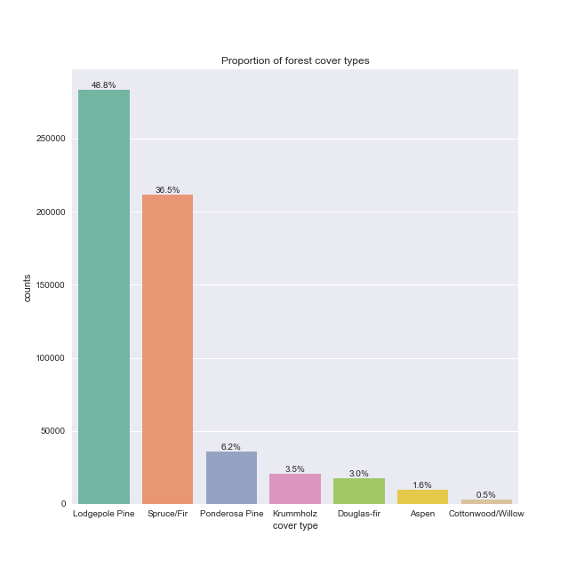
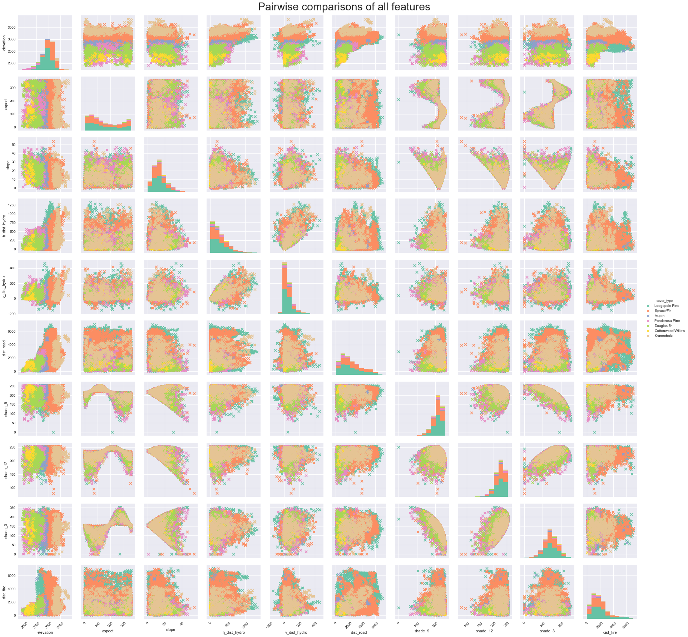
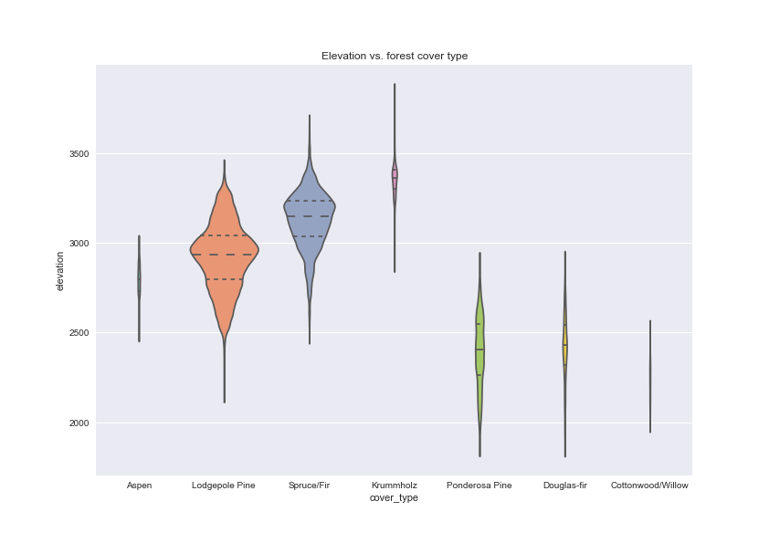
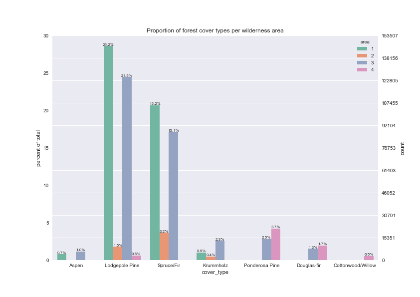
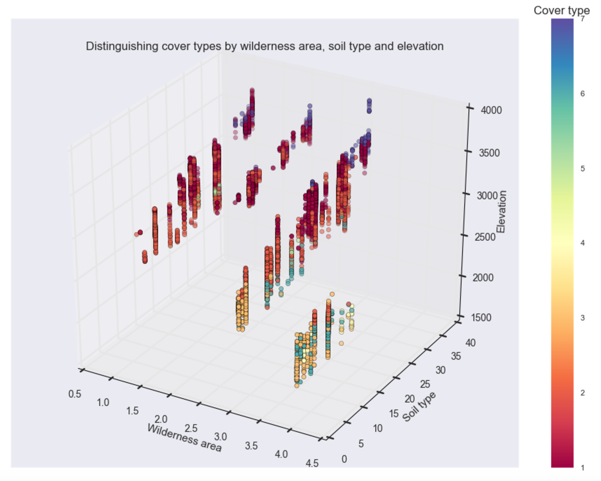
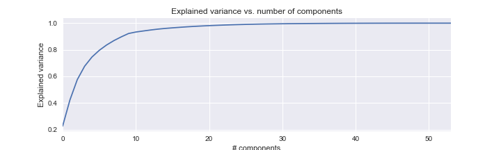
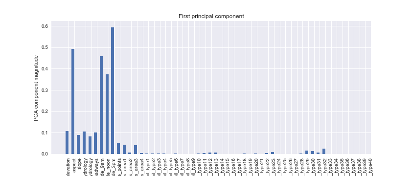

# Prodigy Finance ComputeFest2017 Exploratory Visualization Contest

The contest runs from Tuesday Jan 10th 11.30AM to Thursday Jan 12th 11.59PM. The maximum team size is 2 people, but you can compete individually.
[Prodigy Finance](https://prodigyfinance.com/) has very generously sponsored the ComputeFest and this project in particular. The prizes they have made available are two mystery pieces of electronics for the winning team!

The idea here is to do exploratory visualization in preparation for data analysis. The dataset we will use is from the UCI machine learning repository and can be found [here](https://archive.ics.uci.edu/ml/datasets/Covertype). The features in this dataset are as follows:

Name / Data Type / Measurement / Description 

* Elevation / quantitative /meters / Elevation in meters 
* Aspect / quantitative / azimuth / Aspect in degrees azimuth 
* Slope / quantitative / degrees / Slope in degrees 
* Horizontal_Distance_To_Hydrology / quantitative / meters / Horz Dist to nearest surface water features 
* Vertical_Distance_To_Hydrology / quantitative / meters / Vert Dist to nearest surface water features 
* Horizontal_Distance_To_Roadways / quantitative / meters / Horz Dist to nearest roadway 
* Hillshade_9am / quantitative / 0 to 255 index / Hillshade index at 9am, summer solstice 
* Hillshade_Noon / quantitative / 0 to 255 index / Hillshade index at noon, summer soltice 
* Hillshade_3pm / quantitative / 0 to 255 index / Hillshade index at 3pm, summer solstice 
* Horizontal_Distance_To_Fire_Points / quantitative / meters / Horz Dist to nearest wildfire ignition points 
* Wilderness_Area (4 binary columns) / qualitative / 0 (absence) or 1 (presence) / Wilderness area designation 
* Soil_Type (40 binary columns) / qualitative / 0 (absence) or 1 (presence) / Soil Type designation 
* Cover_Type (7 types) / integer / 1 to 7 / Forest Cover Type designation

The dataset contains cartographic variables that might be useful in predicting the kind of tree cover. Your visualizations should be useful to an analyst in creating machine learning models to analyze this dataset: you are looking for correlations between the "features" and the kind of tree cover.

The visualizations should preferably use technologies you learned in the Python in Data Science workshop such as matplotlib and Bokeh, but you are free to use other software such as R or Tableau. Make sure to label your axes clearly and caption and legend your images.

The deliverable for this project is a report which puts together these visualizations with some description of the visualizations (no long essays please!). This report should be in PDF or HTML format; Microsoft Word or Apple Pages formats will specifically not be accepted.

## Recommendations

From our exploration of the dataset (see the notebook [here](cov_type.ipynb) for full code), we would recommend the following features as being the most likely candidates to help predict forest cover type of a region:
* Elevation
* Aspect of the hill
* Hillshade indices 
* Distance to road ways, fire points and wilderness area may also contribute

## Visualizating features in the dataset to separate forest cover types
Let's first investigate the proportion of forest cover types (our response variable) in our dataset.

There is a very clear imbalance between the seven classes. This will need to be taken into account when building a predictive model. 

Furthermore, there are too many samples in the data set to visualize easily. We will thus select a subset of our data in a stratified manner to preserve the relative percentages of cover types for visualizations and plot this subset. During model training, oversampling of the less represented classes or undersampling of the major class should be considered.

To investigate pairwise relationships between our quantitative features, let's plot our subset data in a pair plot.

From these plots we can note several trends:
* Several features are correlated; however, many correlations are not simple linear ones, therefore Pearson's correlation will not capture the relationship between these variables. Furthermore, the non-linear relationships look spherical or periodic, consistent with angle measurements.
* Even though we don't have many featuers, dimensionality reduction could still aid in visualizing/identifying important features for classification.
* Most of the quantitative features seem to be evenly distributed across the seven cover types.
* Elevation (top row) is the only feature where some clustering by cover type can be discerned.

As elevation seemed to cluster data by cover type, let's plot elevation vs. cover type individually.

Elevation achieves some separation between the cover types and will thus serve as a good predictor. Note the area of the violin plots are scaled by the number of samples per forest cover type.

Our pair plot did not visualize categorical variables. There are 40 soil types, which makes visualization difficult, but we can plot the proportion of forest cover types by wilderness area.

We may be able to separate Spruce/Firs and Lodgepole pines from the other cover types by wilderness area, but any further splits on wilderness area alone are not possible.

Let's plot a three-way comparison between soil type, wilderness area and elevation to see whether we can easily separate the different cover types.

This plot suggests classification of forest cover type by these three features may be a good place to start; however, there is still a lot of overlap between the different cover types, particularly between Spruce/Firs (cover type 1) and Lodgepole pines (cover type 2).

## Dimensionality reduction to visualize data

Although this data set only has 12 features, it is still difficult to visualize the interactions of all the features and identify those that will be important for predicting forest cover type. Although we've identified three features (see 3D plot above) that may be a good starting point for our model, we want to know if we can reduce the overlap even further. Therefore, dimensionality reduction may still aid visualization and feature selection. We will use PCA to reduce our dimensions and visualize the features that make up the resulting principal components.

**Note:** In reality, PCA is not a robust technique for data with a mix of categorical and quantitative data due to the underlying assumption of linearity of this method. Furthermore, our pair plot revealed many non-linear relationships between just the quantitative variables themselves. Therefore PCA should not be used in an actual predictive modeling pipeline of these data.

92.21% of the variance is explained by the first 10 components. Let's look at which features made up the first 2 components.

From the plot of the first principal component, we note that **hillshade** and **aspect** (features relating to how much sunlight is received) make up most of the first principal component. These were features that were difficult to identify from simple pairwise comparisons, highlighting the importance of examining the entire feature space. 

Again, however, we must keep certain caveats in mind, namely: 1) we do know there is a fair amount of non-linearity in the data, which PCA may not capture (a nonlinear kernel may help), and 2) the categorical data are likely not well represented. For example, it is unclear whether their individual component magnitudes should be summed to determine the contribution of these categories; as already mentioned, other methods may be superior.

The second principal component is slightly more complicated, but, in addition to hillshade, **slope** of the hill, **distance to roadways**, **elevation** and **distance to fire points** all seem to contribute. Overall, our PCA has identified features related to hill shape as important ones to include in a classifier. It looks like wilderness area, if summed across the four areas, also has an important contribution.

## Conclusions

Our visualizations suggest that features relating to the amount of sunlight the region receives, such as hillshade and aspect ratio, as well as the elevation of the region, could be important variables for downstream predictive modeling.
